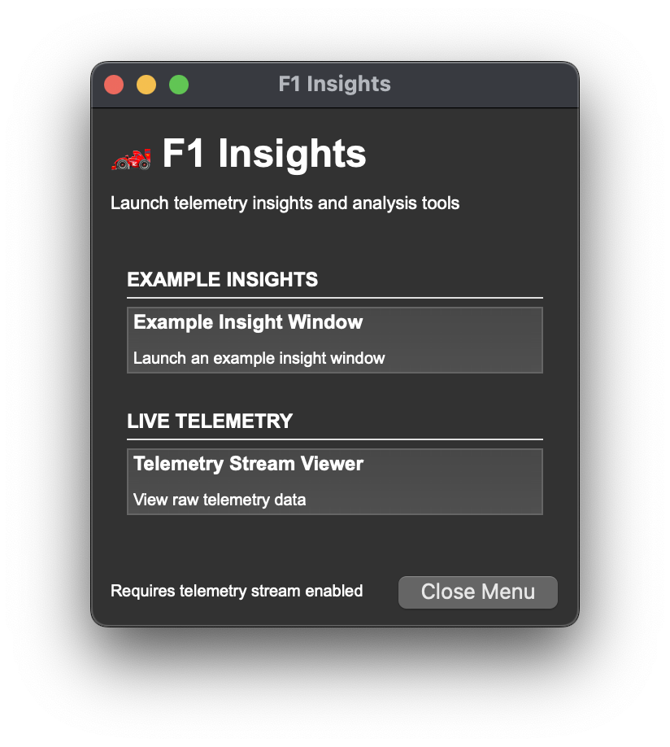

# Insights Menu

## Overview

The Insights Menu is a PySide6 window that launches automatically when the race replay starts. It provides quick access to telemetry analysis tools and insight windows. The menu stays open alongside the replay and allows you to launch multiple insight windows.



### Active Insights
- **Example Insight Window** - A working example demonstrating the PitWallWindow pattern
- **Telemetry Stream Viewer** - View raw telemetry data in real-time

## Usage

The menu launches automatically when you start a race replay and open a "Race" session.

## Adding New Buttons to the Menu

To add a new insight button to the menu, follow these steps:

### Step 1: Create Your Insight Window

First, create your insight window using the `PitWallWindow` base class:

```python
# src/gui/my_custom_insight.py
from src.gui.pit_wall_window import PitWallWindow
from PySide6.QtWidgets import QWidget, QVBoxLayout, QLabel

class MyCustomInsight(PitWallWindow):
    """My custom telemetry insight."""
    
    def setup_ui(self):
        """Create the custom UI."""
        central_widget = QWidget()
        self.setCentralWidget(central_widget)
        
        layout = QVBoxLayout(central_widget)
        self.data_label = QLabel("Waiting for data...")
        layout.addWidget(self.data_label)
    
    def on_telemetry_data(self, data):
        """Process incoming telemetry data."""
        # Your data processing logic
        self.data_label.setText(f"Latest data: {data}")
    
    def on_stream_error(self, error_msg):
        """Handle errors."""
        self.data_label.setText(f"Error: {error_msg}")
```

### Step 2: Add a Launch Method

In `src/gui/insights_menu.py`, add a launch method for your insight:

```python
def launch_my_custom_insight(self):
    """Launch my custom insight window."""
    print("🚀 Launching: My Custom Insight")
    from src.gui.my_custom_insight import MyCustomInsight
    window = MyCustomInsight()
    window.show()
    self.opened_windows.append(window)
```

### Step 3: Add the Button to a Category

In the `setup_ui()` method of `InsightsMenu`, add your button to an existing category or create a new one:

**Adding to an existing category:**

```python
content_layout.addWidget(self.create_category_section(
    "Live Telemetry",
    [
        ("Telemetry Stream Viewer", "View raw telemetry data", self.launch_telemetry_viewer),
        ("My Custom Insight", "Description of what it does", self.launch_my_custom_insight),  # Add here
    ]
))
```

**Creating a new category:**

```python
content_layout.addWidget(self.create_category_section(
    "Custom Analysis",
    [
        ("My Custom Insight", "Description of what it does", self.launch_my_custom_insight),
    ]
))
```

### Step 4: Test Your Button

Run the menu standalone to test your new button:

```bash
python -m src.gui.insights_menu
```

This will open the Insights Menu without starting a replay. The window wouldn't be connected to telemetry unless you start a replay, but you can verify that the button launches your insight window correctly.s

## Architecture

### Menu Structure
```
InsightsMenu (QMainWindow)
├── Header
│   ├── Title: "🏎️ F1 Insights"
│   └── Subtitle: "Launch telemetry insights and analysis tools"
├── Scrollable Content (QScrollArea)
│   ├── Category Section 1
│   │   ├── Category Label (e.g., "EXAMPLE INSIGHTS")
│   │   ├── Separator Line
│   │   ├── Insight Button 1 (name + description)
│   │   ├── Insight Button 2
│   │   └── ...
│   ├── Category Section 2
│   │   └── ...
│   └── Stretch (pushes footer to bottom)
└── Footer
    ├── Info Label: "Requires telemetry stream enabled"
    └── Close Menu Button
```

### Key Components

**`create_category_section(category_name, insights)`**
- Creates a category section with multiple insight buttons
- `insights`: List of tuples `(name, description, callback)`
- Each tuple becomes a clickable button

**`create_insight_button(name, description, callback)`**
- Creates a styled button with bold name and smaller description
- Minimum height: 50px
- Connects the button to the launch callback

**`opened_windows` list**
- Keeps references to all launched insight windows
- Prevents Python from garbage collecting active windows
- Windows remain open even if menu is closed

### Launch Process

1. User starts replay with `python main.py --viewer`
2. `main.py` calls `launch_insights_menu()` from `src.run_session`
3. Menu window is created and shown
4. User clicks insight buttons to open analysis windows
5. Each insight launches in its own window with independent telemetry connection

## Customization

### Styling

The menu uses inline stylesheets (no external CSS). The default theme is dark with minimal styling:

- **Background**: Dark (inherits from system theme)
- **Font**: Arial at various sizes (24pt title, 12pt buttons, 10pt descriptions)
- **Buttons**: Minimum 50px height with name and description
- **Cursor**: Pointing hand cursor on buttons

To customize the appearance, edit the `setup_ui()` method and add a stylesheet:

```python
self.setStyleSheet("""
    QMainWindow {
        background-color: #1e1e1e;
    }
    QPushButton {
        background-color: #2d2d2d;
        border: 1px solid #3d3d3d;
        border-radius: 4px;
        padding: 8px;
    }
    QPushButton:hover {
        border: 1px solid #e10600;  /* Ferrari red */
        background-color: #3d3d3d;
    }
""")
```

### Window Size and Position

Adjust in `__init__()`:

```python
self.setGeometry(50, 50, 300, 600)  # x, y, width, height
```

### Button Layout and Appearance

Modify `create_insight_button()` to customize buttons:

```python
def create_insight_button(self, name, description, callback):
    button = QPushButton()
    
    # Custom layout
    btn_layout = QVBoxLayout()
    name_label = QLabel(name)
    name_label.setFont(QFont("Arial", 14, QFont.Bold))  # Larger font
    
    desc_label = QLabel(description)
    desc_label.setFont(QFont("Arial", 9, QFont.Italic))  # Italic description
    
    btn_layout.addWidget(name_label)
    btn_layout.addWidget(desc_label)
    
    button.setLayout(btn_layout)
    button.setMinimumHeight(60)  # Taller buttons
    button.clicked.connect(callback)
    
    return button
```

## See Also

- [PitWallWindow.md](./PitWallWindow.md) - Base class for creating insights
- [../src/gui/insights_menu.py](../src/gui/insights_menu.py) - Menu implementation
- [../src/gui/example_pit_wall_window.py](../src/gui/example_pit_wall_window.py) - Example insight
