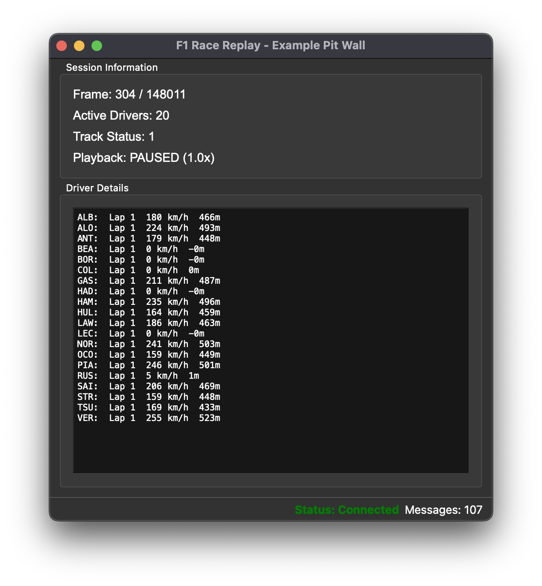

# PitWallWindow Developer Guide

## Overview

`PitWallWindow` is a base class that simplifies creating custom telemetry-enabled windows in the F1 Race Replay project. It handles all the complexity of connecting to the telemetry stream, allowing developers to focus solely on building their window's functionality.



## Why Use PitWallWindow?

Without `PitWallWindow`, you would need to:
- Create and configure a `TelemetryStreamClient`
- Connect Qt signals for data reception, connection status, and errors
- Handle proper cleanup when the window closes
- Manage connection state and message counting

With `PitWallWindow`, you simply:
1. Extend the class
2. Implement `setup_ui()` to create your interface
3. Implement `on_telemetry_data()` to process data

## Using the Template

To quickly get started, use the [`pit_wall_window_template.py`](../src/gui/pit_wall_window_template.py) template file. It provides a pre-configured structure with all necessary imports and method stubs, so you can focus on implementing your insight's core logic.


## Quick Start

```python
from src.gui.pit_wall_window import PitWallWindow
from PySide6.QtWidgets import QWidget, QVBoxLayout, QLabel

class MyInsightWindow(PitWallWindow):
    def __init__(self):
        super().__init__()
        self.setWindowTitle("My Custom Insight")
    
    def setup_ui(self):
        central_widget = QWidget()
        self.setCentralWidget(central_widget)
        layout = QVBoxLayout(central_widget)
        
        self.info_label = QLabel("Waiting for data...")
        layout.addWidget(self.info_label)
    
    def on_telemetry_data(self, data):
        if 'frame_index' in data:
            self.info_label.setText(f"Frame: {data['frame_index']}")
```

Your window will automatically connect to the telemetry stream and start receiving data.

**Example:**

```python
def on_telemetry_data(self, data):
    # Update frame counter
    if 'frame_index' in data:
        self.frame_label.setText(f"Frame: {data['frame_index']}")
    
    # Process driver data
    if 'frame' in data and 'drivers' in data['frame']:
        drivers = data['frame']['drivers']
        for code, driver in drivers.items():
            speed = driver.get('speed', 0)
            if speed > 300:  # Highlight high-speed moments
                self.highlight_driver(code, speed)
```

### `on_connection_status_changed(status)` (Optional)

Called when the connection state changes.

**Parameters:**
- `status` (str): One of "Connected", "Connecting...", or "Disconnected"

**Example:**

```python
def on_connection_status_changed(self, status):
    if status == "Connected":
        self.enable_controls()
    else:
        self.disable_controls()
```

### `on_stream_error(error_msg)` (Optional)

Called when a stream error occurs. The error is already displayed in the status bar, but you can add custom handling.

**Parameters:**
- `error_msg` (str): Description of the error

**Example:**

```python
def on_stream_error(self, error_msg):
    self.error_log.append(f"[{datetime.now()}] {error_msg}")
```

## Built-in Features

### Status Bar

Every `PitWallWindow` includes a status bar with:
- **Connection Status**: Shows current connection state with color coding (green=connected, orange=connecting, red=disconnected)
- **Message Counter**: Displays total messages received

You can add additional widgets to the status bar:

```python
def setup_ui(self):
    # ... your UI setup ...
    
    # Add custom status widget
    my_status = QLabel("Custom Info")
    self.status_bar.addPermanentWidget(my_status)
```

### Automatic Cleanup

The base class handles proper cleanup when the window closes, ensuring the telemetry client is stopped and resources are released.

## Running Your Window

### Standalone

```python
if __name__ == "__main__":
    app = QApplication(sys.argv)
    window = MyInsightWindow()
    window.show()
    sys.exit(app.exec())
```

### From Main Application

Add a menu item or button in the main application:

```python
def launch_my_insight(self):
    self.insight_window = MyInsightWindow()
    self.insight_window.show()
```
